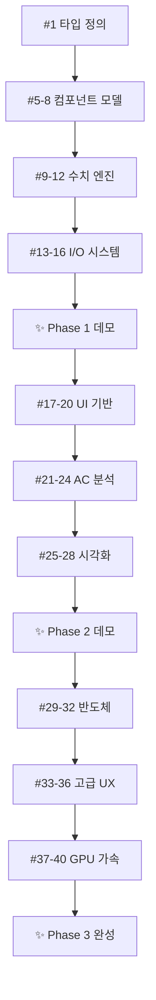

# WebSpice Development Task Breakdown

Phase별 개발 태스크 분해 및 의존성 관리 문서

## 📊 Overview

이 문서는 WebSpice 프로젝트의 체계적 개발을 위한 Phase별 태스크 분해 계획을 다룹니다. 각 Phase는 독립적으로 완성 가능하며, 점진적으로 기능을 확장하는 구조로 설계되었습니다.

## 🏗 Phase 1: Foundation Engine (MVP)

**목표**: DC 분석 가능한 최소 기능 구현  
**완성 기준**: JSON 회로 입력 → DC 분석 → 콘솔 결과 출력  
**예상 소요**: 4-6주

### Infrastructure Tasks

| ID  | 타입 | 제목                                 | 설명                                                       | 우선순위 | 의존성 |
| --- | ---- | ------------------------------------ | ---------------------------------------------------------- | -------- | ------ |
| #1  | TASK | TypeScript 타입 정의 구조 설계       | Component, Circuit, Node, Analysis 등 핵심 인터페이스 정의 | HIGH     | -      |
| #2  | TASK | Redux 스토어 기본 구조 설정          | Circuit, Simulation 상태 슬라이스 구현                     | HIGH     | #1     |
| #3  | TASK | 테스트 유틸리티 및 헬퍼 함수 구현    | TDD를 위한 테스트 헬퍼, 모크 데이터 생성기                 | HIGH     | #1     |
| #4  | TASK | 프로젝트 폴더 구조 및 개발 환경 검증 | 실제 개발 시작 전 환경 최종 검증                           | MED      | -      |

### Component Models (TDD 기반)

| ID  | 타입 | 제목                                     | 설명                                             | 우선순위 | 의존성     |
| --- | ---- | ---------------------------------------- | ------------------------------------------------ | -------- | ---------- |
| #5  | FEAT | 저항(Resistor) 컴포넌트 모델 구현        | 옴의 법칙 기반 저항 모델, 입력 검증, 단위 테스트 | HIGH     | #1, #3     |
| #6  | FEAT | 전압원(VoltageSource) 컴포넌트 모델 구현 | DC/AC 전압원 모델, 파라미터 검증                 | HIGH     | #1, #3     |
| #7  | FEAT | 전류원(CurrentSource) 컴포넌트 모델 구현 | DC/AC 전류원 모델, 극성 관리                     | HIGH     | #1, #3     |
| #8  | FEAT | 기본 회로(Circuit) 클래스 구현           | 컴포넌트 관리, 노드 연결, 회로 검증              | HIGH     | #5, #6, #7 |

### Numerical Engine

| ID  | 타입 | 제목                                     | 설명                                       | 우선순위 | 의존성   |
| --- | ---- | ---------------------------------------- | ------------------------------------------ | -------- | -------- |
| #9  | FEAT | 행렬 연산 유틸리티 구현 (Matrix, Vector) | 기본 행렬 연산, 희소행렬 지원, 수치 안정성 | HIGH     | #1, #3   |
| #10 | FEAT | LU 분해 알고리즘 구현                    | 피벗팅 포함 LU 분해, 특이행렬 처리         | HIGH     | #9       |
| #11 | FEAT | 노달 분석 DC 해석기 구현                 | Modified Nodal Analysis 기반 DC 해법       | HIGH     | #8, #10  |
| #12 | FEAT | Newton-Raphson 수렴 알고리즘 구현        | 비선형 해석을 위한 반복 해법, 수렴 조건    | HIGH     | #10, #11 |

### I/O & Integration

| ID  | 타입 | 제목                        | 설명                                 | 우선순위 | 의존성   |
| --- | ---- | --------------------------- | ------------------------------------ | -------- | -------- |
| #13 | FEAT | JSON 회로 파서 구현         | JSON 형식 회로 정의 파싱, 오류 처리  | HIGH     | #8       |
| #14 | FEAT | 시뮬레이션 결과 포매터 구현 | 결과 데이터 구조화, 포맷팅, 내보내기 | HIGH     | #11, #12 |
| #15 | TEST | 전체 DC 분석 통합 테스트    | End-to-end DC 분석 워크플로 검증     | HIGH     | #13, #14 |
| #16 | FEAT | 콘솔 출력 시스템 구현       | 개발자 친화적 결과 표시, 디버깅 정보 | MED      | #14      |

**Phase 1 완료 시**:

```bash
# 예상 사용법
npm run webspice -- analyze ./examples/voltage_divider.json
# 출력: 노드 전압, 브랜치 전류, 수렴 정보
```

---

## 🎨 Phase 2: Basic UI

**목표**: 시각적 회로 에디터 + AC 분석  
**완성 기준**: 브라우저에서 회로 그리기 → DC/AC 분석 → 그래프 결과  
**예상 소요**: 6-8주

### Visual Components

| ID  | 타입 | 제목                         | 설명                                 | 우선순위 | 의존성 |
| --- | ---- | ---------------------------- | ------------------------------------ | -------- | ------ |
| #17 | FEAT | Canvas 기반 회로 에디터 구현 | HTML5 Canvas를 이용한 회로도 편집기  | HIGH     | #8     |
| #18 | FEAT | 컴포넌트 팔레트 UI 구현      | 드래그 가능한 컴포넌트 라이브러리 UI | HIGH     | #17    |
| #19 | FEAT | 드래그앤드롭 컴포넌트 배치   | 마우스/터치로 컴포넌트 배치 기능     | HIGH     | #18    |
| #20 | FEAT | 와이어 연결 시스템 구현      | 컴포넌트 간 전기적 연결 관리         | HIGH     | #19    |

### Advanced Analysis

| ID  | 타입 | 제목                          | 설명                              | 우선순위 | 의존성        |
| --- | ---- | ----------------------------- | --------------------------------- | -------- | ------------- |
| #21 | FEAT | 캐패시터(Capacitor) 모델 구현 | 주파수 의존적 임피던스, AC 해석용 | HIGH     | #1, #3        |
| #22 | FEAT | 인덕터(Inductor) 모델 구현    | 주파수 의존적 임피던스, AC 해석용 | HIGH     | #1, #3        |
| #23 | FEAT | AC 분석 엔진 구현             | 주파수 영역 해석, 복소수 연산     | HIGH     | #21, #22, #11 |
| #24 | FEAT | 주파수 응답 계산기 구현       | Bode plot용 주파수 스위핑         | HIGH     | #23           |

### Visualization

| ID  | 타입 | 제목                           | 설명                                 | 우선순위 | 의존성   |
| --- | ---- | ------------------------------ | ------------------------------------ | -------- | -------- |
| #25 | FEAT | 기본 그래프 차트 컴포넌트 구현 | Recharts 기반 그래프 라이브러리 통합 | HIGH     | #14      |
| #26 | FEAT | DC 해석 결과 시각화            | 노드 전압 바 차트, 전류 화살표 표시  | HIGH     | #25, #15 |
| #27 | FEAT | AC 주파수 응답 그래프          | Bode plot (magnitude, phase) 표시    | HIGH     | #24, #25 |
| #28 | FEAT | 속성 패널 UI 구현              | 선택된 컴포넌트 파라미터 편집        | MED      | #20      |

**Phase 2 완료 시**:

```
사용자가 브라우저에서:
1. 컴포넌트 팔레트에서 저항 드래그
2. 캔버스에 저항 배치
3. 전압원과 연결
4. "시뮬레이션" 버튼 클릭
5. 실시간 결과 그래프 확인
```

---

## ⚡ Phase 3: Advanced UX

**목표**: 전문급 사용성 + GPU 최적화  
**완성 기준**: 반도체 회로 분석 + 드래그앤드롭 + 성능 최적화  
**예상 소요**: 8-10주

### Semiconductor Components

| ID  | 타입 | 제목                     | 설명                              | 우선순위 | 의존성        |
| --- | ---- | ------------------------ | --------------------------------- | -------- | ------------- |
| #29 | FEAT | 다이오드 모델 구현       | Shockley 방정식 기반, 비선형 특성 | HIGH     | #12           |
| #30 | FEAT | BJT 트랜지스터 모델 구현 | Ebers-Moll 모델, 3단자 소자       | HIGH     | #29           |
| #31 | FEAT | MOSFET 모델 구현         | Level 1 모델, 게이트 특성         | HIGH     | #30           |
| #32 | FEAT | Transient 분석 엔진 구현 | 시간 영역 해석, 적응적 타임스텝   | HIGH     | #29, #30, #31 |

### Advanced UX

| ID  | 타입 | 제목                         | 설명                               | 우선순위 | 의존성   |
| --- | ---- | ---------------------------- | ---------------------------------- | -------- | -------- |
| #33 | FEAT | 고급 드래그앤드롭 인터페이스 | 다중 선택, 복사/붙여넣기, 실행취소 | MED      | #20, #28 |
| #34 | FEAT | 회로 검증 및 오류 표시       | 실시간 회로 유효성 검사, 경고 표시 | HIGH     | #20      |
| #35 | FEAT | 측정 도구 및 프로브 시스템   | 가상 프로브, 측정값 실시간 표시    | MED      | #27      |
| #36 | FEAT | 파일 저장/불러오기 시스템    | .wspice 형식, 브라우저 파일 API    | HIGH     | #13      |

### GPU Acceleration

| ID  | 타입 | 제목                                 | 설명                             | 우선순위 | 의존성 |
| --- | ---- | ------------------------------------ | -------------------------------- | -------- | ------ |
| #37 | PERF | WebGL 행렬 연산 최적화               | GPU 가속 행렬 연산, 성능 비교    | MED      | #10    |
| #38 | PERF | WebGPU 컴퓨트 셰이더 구현 (선택사항) | 차세대 GPU 가속, 브라우저 지원시 | LOW      | #37    |
| #39 | PERF | 대용량 회로 최적화                   | 희소행렬 최적화, 메모리 관리     | MED      | #37    |
| #40 | PERF | 성능 프로파일링 및 최적화            | 벤치마크 도구, 성능 측정         | MED      | #39    |

**Phase 3 완료 시**:

```
전문급 기능:
- BJT 증폭기 회로 설계 및 분석
- 실시간 파라미터 스위핑
- 1000+ 컴포넌트 회로 처리
- 상용 도구 수준 사용자 경험
```

---

## 🔄 논리적 의존성 체인

### 개발 우선순위



### Critical Path (블로킹 관계)

**반드시 순차 진행**:

1. `#1 (타입)` → `#5-8 (컴포넌트)` → `#9-12 (엔진)` → `#13-16 (I/O)`
2. `#17 (캔버스)` → `#18-20 (UI)` → `#25-28 (시각화)`
3. `#29 (다이오드)` → `#30 (BJT)` → `#31 (MOSFET)` → `#32 (Transient)`

**병렬 진행 가능**:

- `#5, #6, #7` (각 컴포넌트 모델)
- `#21, #22` (캐패시터, 인덕터)
- `#25, #26, #27` (각 그래프 컴포넌트)

### Atomic 완성도 기준

각 Phase 완료시 **독립적으로 동작하는 완성품**:

**Phase 1**: CLI 회로 분석기

```bash
webspice-cli voltage_divider.json  # → 콘솔 결과 출력
```

**Phase 2**: 완전한 웹 시뮬레이터

```
브라우저에서 회로 그리기 + 분석 + 그래프 확인
```

**Phase 3**: 전문가용 도구

```
상용 SPICE 도구 수준의 기능과 성능
```

---

## 📊 리소스 관리

### 예상 개발 시간

| Phase    | 태스크 수 | 예상 시간   | 병렬도  | 실제 소요 |
| -------- | --------- | ----------- | ------- | --------- |
| Phase 1  | 16개      | 4-6주       | 70%     | TBD       |
| Phase 2  | 12개      | 6-8주       | 60%     | TBD       |
| Phase 3  | 12개      | 8-10주      | 50%     | TBD       |
| **총계** | **40개**  | **18-24주** | **60%** | **TBD**   |

### 리스크 관리

**High Risk Tasks**:

- `#12` Newton-Raphson: 수치해석 복잡도 높음
- `#23` AC 분석: 복소수 연산 및 주파수 응답
- `#32` Transient: 시간 영역 해석의 안정성
- `#37-38` GPU 가속: WebGL/WebGPU 학습 곡선

**Mitigation Strategy**:

- 프로토타입 우선 개발 (PoC)
- 단위 테스트 100% 커버리지
- 레퍼런스 구현체 벤치마킹
- 커뮤니티 및 학술 자료 적극 활용

---

## 📝 태스크 생성 가이드

### GitHub Issue 생성시 포함사항

1. **명확한 제목**: `[타입] 간단한 설명 (closes #이전이슈)`
2. **상세 요구사항**: 기능 명세, 입력/출력, 제약사항
3. **완료 조건**: 테스트 가능한 구체적 기준
4. **의존성**: 선행 완료되어야 할 이슈 번호
5. **테스트 계획**: TDD 방식 테스트 케이스
6. **예상 소요**: 시간 추정치 (1-5 포인트)

### 라벨 활용

- **Phase**: `phase-1-mvp`, `phase-2-ui`, `phase-3-ux`
- **타입**: `feature`, `task`, `bug`, `enhancement`
- **우선순위**: `priority-high`, `priority-medium`, `priority-low`
- **영역**: `algorithm`, `ui`, `performance`

---

**이 문서는 개발 진행에 따라 지속적으로 업데이트됩니다.**

Last Updated: 2024-11-24  
Next Review: Phase 1 완료시
